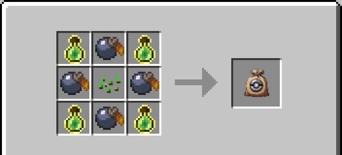
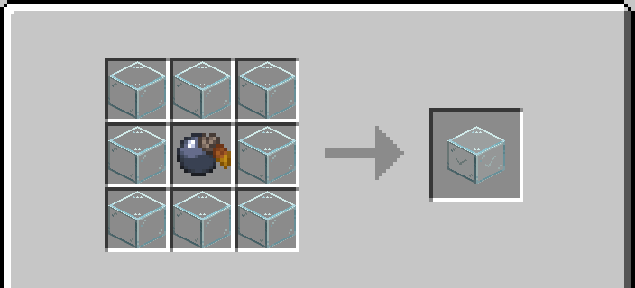
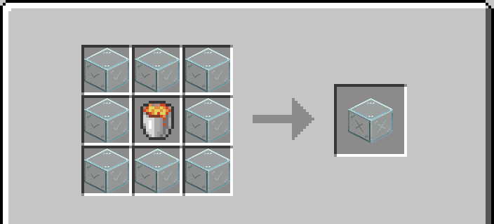
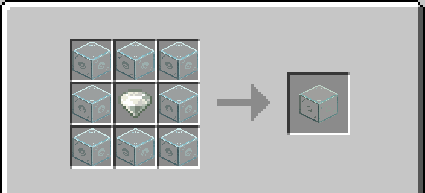
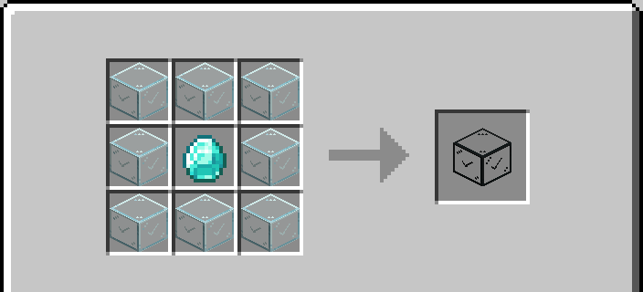

# Gotta Grind Em All - Wiki

A NeoForge 1.21.1 mod that combines [Cobblemon](https://cobblemon.com/) and optionally [Mob Grinding Utils](https://www.curseforge.com/minecraft/mc-mods/mob-grinding-utils) to enable grinding and farming of Cobblemon.

**Required:** Cobblemon
**Optional:** Mob Grinding Utils
**Optional:** Jade

---

## Items & Blocks

### Cobblemon Egg

Use on Grass, Dirt, Mycelium, or Farmland to convert a 5x5 area into Cobblemon Dirt. Consumed on use. Does not stack.

### Cobblemon Dirt

A block that periodically spawns random Cobblemon when the light level above it is 10 or higher and the space above is clear. Up to 8 mon can exist in an 11x5x11 area before spawning stops.

Spawn rarity is controlled by configurable bucket weights (see [Configuration](#configuration)). Stacks to 64.

#### Redstone Integration

Cobblemon Dirt responds to redstone signals:

- **Constant ON signal**: Disables natural spawning. The block will not spawn any mon while powered.
- **Rising edge (signal turns on)**: Forces an immediate spawn attempt, ignoring the normal timer. This allows redstone clocks and pulse circuits to control spawn timing precisely.

This means you can use a redstone clock to trigger spawns on demand, or power the block to pause spawning entirely. With [Jade](https://www.curseforge.com/minecraft/mc-mods/jade) installed, the tooltip will show "Spawning Disabled via Redstone" when the block is powered.

### Pocket Chow

Use on a Cobblemon to trigger an explosive reaction. The mon floats upward for about 1 second, then explodes with a creeper death sound and particles, dropping a **Cobblemon Egg**. Does not stack.

#### Recipe

The recipe changes depending on whether Mob Grinding Utils is installed.

**Without Mob Grinding Utils** (default):



| Slot | Ingredient |
|------|------------|
| B | Bottle o' Enchanting |
| A | Any Apricorn (from `cobblemon:apricorns` tag) |
| S | Any Seeds (from `c:seeds` tag) |

```
B A B
A S A
B A B
```

**With Mob Grinding Utils** installed:

| Slot | Ingredient |
|------|------------|
| B | Experience Fluid (1000 mB, from `c:experience` tag) |
| A | Any Apricorn (from `cobblemon:apricorns` tag) |
| S | Any Seeds (from `c:seeds` tag) |

```
B A B
A S A
B A B
```

### Cobblemon Filter Glass (Inclusion, Any)

A glass block that **only Cobblemon can pass through**. Players and other mobs are blocked.

Periodically grounds nearby flying Cobblemon so that fans and other forced-movement devices work correctly.

#### Recipe



| Slot | Ingredient |
|------|------------|
| G | Vanilla Glass |
| A | Any Apricorn (from `cobblemon:apricorns` tag) |

```
G G G
G A G
G G G
```

Produces 8 Inclusion Filter Glass (Any).

---

### Cobblemon Filter Glass (Exclusion, Any)

A glass block that **blocks all Cobblemon** while letting players and other mobs pass through freely.

Periodically grounds nearby flying Cobblemon so that fans and other forced-movement devices work correctly.

#### Recipe



| Slot | Ingredient |
|------|------------|
| I | Inclusion Filter Glass (Any) |
| L | Lava Bucket |

```
I I I
I L I
I I I
```

Produces 8 Exclusion Filter Glass (Any).

---

### Cobblemon Filter Glass (Typed)

Type-specific variants of the filter glass blocks. There are 18 types matching Cobblemon's elemental types: Normal, Fire, Water, Grass, Electric, Ice, Fighting, Poison, Ground, Flying, Psychic, Bug, Rock, Ghost, Dragon, Dark, Steel, and Fairy.

- **Inclusion (typed)**: Only Cobblemon of the matching type can pass through. All others are blocked.
- **Exclusion (typed)**: Cobblemon of the matching type are blocked. Everything else passes through freely.

#### Recipe



| Slot | Ingredient |
|------|------------|
| G | Inclusion or Exclusion Filter Glass (Any) |
| C | Type Gem matching the desired type (e.g. `cobblemon:fire_gem`) |

```
G G G
G C G
G G G
```

Produces 8 typed filter glass of the corresponding variant (inclusion or exclusion) and type.

---

### Cobblemon Filter Glass (Tag-based)

Filter glass blocks based on Cobblemon labels rather than elemental type. Available tags:

| Tag | Display Name | Recipe Ingredient |
|-----|--------------|-------------------|
| `starter` | Starter | Diamond |
| `baby` | Baby | Emerald |
| `gen1` | Generation I | Stone |
| `gen2` | Generation II | Granite |
| `gen3` | Generation III | Diorite |
| `gen4` | Generation IV | Andesite |
| `gen5` | Generation V | Deepslate |
| `gen6` | Generation VI | Calcite |
| `gen7` | Generation VII | Tuff |
| `gen7b` | Generation VII-B | Basalt |
| `gen8` | Generation VIII | Blackstone |
| `gen8a` | Generation VIII-A | Netherrack |
| `gen9` | Generation IX | End Stone |

- **Inclusion (tagged)**: Only Cobblemon with the matching label can pass through.
- **Exclusion (tagged)**: Cobblemon with the matching label are blocked. Everything else passes freely.

#### Recipe



| Slot | Ingredient |
|------|------------|
| G | Inclusion or Exclusion Filter Glass (Any) |
| C | Label ingredient (see table above) |

```
G G G
G C G
G G G
```

Produces 8 tag filter glass of the corresponding variant and label.

---

## Configuration

Server-side configuration is found in `gottagrindemall-server.toml`.

| Setting | Default | Description |
|---------|---------|-------------|
| `allow_shiny` | `true` | Allow shiny mon to spawn from Cobblemon Dirt |
| `spawn_weights.common_spawn_weight` | `100.0` | Weight for common mon spawns |
| `spawn_weights.uncommon_spawn_weight` | `10.0` | Weight for uncommon mon spawns |
| `spawn_weights.rare_spawn_weight` | `5.0` | Weight for rare mon spawns |
| `spawn_weights.ultra_rare_spawn_weight` | `1.0` | Weight for ultra-rare mon spawns |

Spawn weights are normalized so the total equals 100%. For example, setting common=2, uncommon=1, rare=1, ultra_rare=1 means 40% common and 20% each for the other tiers. Set a weight to 0 to disable that tier entirely.

---

## Regenerating Recipe Images

Recipe images can be regenerated with:

```
python3 wiki/generate_recipe_images.py
```

Requires Python 3 with Pillow (`pip install Pillow`).
